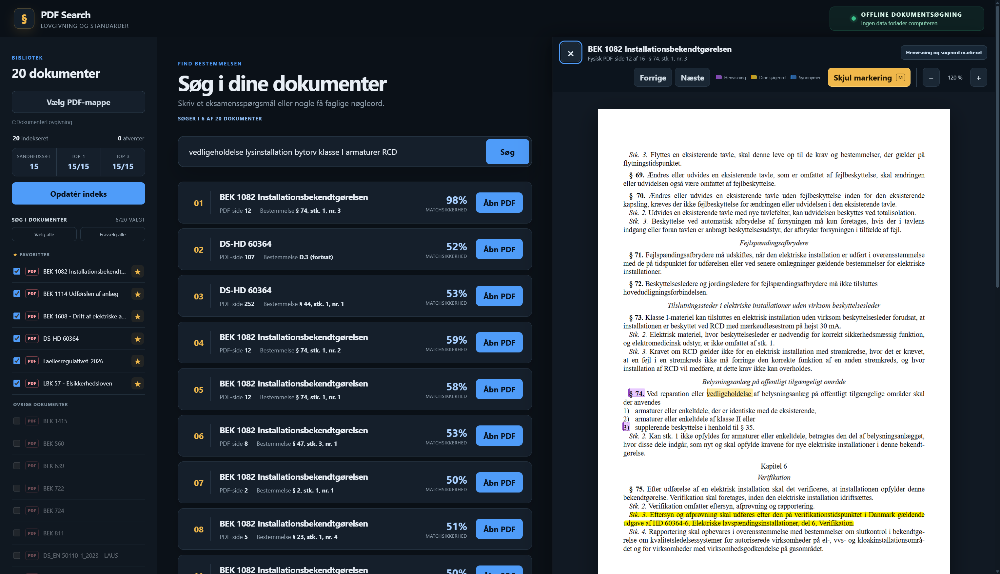

#  PDF Search

**PDF Search** er et offline Windows-program til hurtig søgning i lokale PDF-dokumenter med præcise henvisninger til dokument, fysisk PDF-side og bestemmelse. PDF-tekst, OCR, søgeindeks og sandhedssæt behandles lokalt på computeren.



## Download

Hent den nyeste version under [GitHub Releases](https://github.com/AidedPolecat6/pdf-search/releases/latest):

- `PDF Search Setup` installerer programmet i Windows.
- `PDF Search Portable` kan startes direkte uden installation.

Programmet er endnu ikke signeret med et kommercielt Windows-certifikat. Windows SmartScreen kan derfor vise en advarsel ved første start. Kontrollér, at filen er hentet fra dette repositorys officielle release-side.

## Kom hurtigt i gang

1. Start `PDF Search.exe`, eller installer programmet med `PDF Search Setup`.
2. Tryk **Vælg PDF-mappe** i venstre side.
3. Vælg den mappe, der indeholder dine PDF-dokumenter.
4. Vent, mens proceslinjen kontrollerer og indekserer dokumenterne.
5. Skriv et spørgsmål eller nogle faglige søgeord i søgefeltet.
6. Tryk **Søg**, og vælg derefter **Åbn PDF** ved det ønskede resultat.

Programmet husker den valgte mappe. Ved næste start genbruges uændrede dokumenter, mens nye, ændrede og slettede PDF-filer opdateres automatisk.

## Søgning

Du kan skrive almindelige spørgsmål eller korte faglige søgeord:

```text
SPD offentlig elbil lader
```

Programmet anvender faglige synonymer til at finde relevante formuleringer i dokumenterne.

Brug dobbelte citationstegn, når en bestemt frase skal forekomme i PDF-teksten:

```text
"30 mA" "CEE-stikkontakt"
```

Hvis søgningen indeholder flere citerede fraser, skal alle fraser forekomme i det samme resultat. Store og små bogstaver samt PDF-linjeskift påvirker ikke frasesøgningen.

### Markeringsfarver

- **Lilla:** den bestemmelse, paragraf, stykke eller det nummer, som resultatet henviser til.
- **Gul:** ord og fraser, du selv har skrevet.
- **Blå:** faglige synonymer, som programmet har fundet i PDF'en.

Markeringer fra usynlige eller beskårne tekstlag i PDF-filen filtreres fra. Fremviseren ruller først til den lilla henvisning, når den kan findes præcist.

## Dokumentoversigten

Checkboxen ud for hvert dokument bestemmer, om dokumentet indgår i søgningen.

- **Vælg alle** aktiverer samtlige dokumenter.
- **Fravælg alle** deaktiverer samtlige dokumenter.
- Ændringer slår igennem uden en ny indeksering.
- Valgene gemmes automatisk.

### Favoritter

Dokumenter, du ofte bruger, kan placeres i sektionen **Favoritter** øverst i oversigten:

1. Tryk på stjernen ud for dokumentet, eller højreklik på dokumentet.
2. Vælg **Tilføj til favoritter**.
3. Brug den samme handling for at fjerne dokumentet igen.

Favoritter påvirker ikke søgerangeringen. De gør det kun hurtigere at finde og slå bestemte dokumenter til eller fra.

## PDF-fremviseren

PDF-fremviseren er altid synlig i højre side. Når intet dokument er åbent, vises teksten **PDF-FREMVISER**.

Når du trykker **Åbn PDF**, åbnes hele dokumentet direkte på den relevante fysiske PDF-side. Søgeord og synonymer markeres uden at ændre originalfilen.

- **Forrige/Næste:** skift fysisk PDF-side.
- **−/+**: juster zoom.
- **Skjul markering/Vis markering:** slå markeringer til eller fra.
- **M:** skift markeringer til eller fra med tastaturet.
- **Escape:** luk dokumentet og returner fokus til knappen **Åbn PDF**.

## Søgeresultater

Hvert resultat viser:

- Dokumentnavn
- Fysisk PDF-side
- Bestemmelse eller paragraf
- Matchsikkerhed
- Om teksten kommer fra OCR

Matchsikkerhed er en deterministisk lokal vurdering. Den sendes ikke til en ekstern tjeneste.

## Sandhedssættet

Det fælles sandhedssæt findes i:

```text
data/Sandheder til Spørgsmål 3 i el auto eksaminer.xlsx
```

En CSV-kopi ligger i samme mappe, så ændringer kan gennemgås på GitHub. Excel-filen er den version, programmet indlæser.

Sådan bidrager du:

1. Tilføj eller ret en række i Excel-filen.
2. Bevar kolonnerne `ID`, `Spørgsmål`, `Korrekt dokument`, `Bestemmelse`, `Fysisk PDF-side`, `Svar`, `Facitforklaring`, `Eventuelle nøgleord` og `Kontrolleret`.
3. Kør `npm run export:truths` for at opdatere CSV-filen.
4. Kontrollér, at `npm test` består.
5. Opret et commit og en pull request.

En fil med navnet `Sandheder*.xlsx` i den valgte PDF-mappe fungerer som lokal override af det medfølgende sandhedssæt.

> **PDF-filer må aldrig tilføjes til repositoryet.** Brugeren vælger selv sin lokale dokumentmappe. `.gitignore` blokerer PDF-filer som ekstra sikkerhed.

## Lokal lovoversigt

Hvis `Oversigt lovgivning PM.xlsx` ligger i den valgte PDF-mappe, indlæser programmet automatisk arkets kapitelnavne, emner og PDF-sidetal som ekstra lokal søgemetadata. Oplysningerne hjælper søgerangeringen, men kopieres ikke til søgeindekset eller den pakkede app.

Filen er lokal og ignoreres altid af Git. Programmet fungerer fortsat normalt, hvis filen ikke findes.

## Portable version

`PDF Search Portable` kræver ingen installation. Placér den portable `.exe` i en mappe, hvor du har skriverettigheder, og start den direkte.

Ved første start oprettes mappen:

```text
PDF Search Data
```

Mappen ligger ved siden af den portable `.exe` og indeholder indeks, favoritter, dokumentvalg og øvrige lokale indstillinger. Flyt både `.exe`-filen og `PDF Search Data`, hvis programmet skal flyttes til en anden placering.

PDF-dokumenterne følger ikke automatisk med. Hvis deres sti eller drevbogstav ændres, skal PDF-mappen vælges igen.

## Privatliv og offline-drift

- Ingen cloudtjeneste eller ekstern database anvendes.
- Ingen PDF-tekst eller søgning forlader computeren.
- OCR-modellerne til dansk og engelsk følger med programmet.
- Den pakkede brugerflade blokerer `http`, `https`, `ws` og `wss`.
- Windows Firewall kan bruges som en yderligere systembaseret blokering.

## Udvikling

Kræver Node.js og Windows.

```powershell
npm ci
npm run dev
```

Kontrol og builds:

```powershell
npm run typecheck
npm test
npm run package
npm run package:portable
```

- `npm run package` bygger Windows-installationsfilen.
- `npm run package:portable` bygger den installationsfrie portable version.
- `npm run export:truths` opdaterer CSV-kopien af sandhedssættet.

Repositoryet indeholder kildekode, ikon og sandhedssæt, men ingen PDF-dokumenter eller lokale søgeindeks.

## Licens

PDF Search er fri software under [GNU General Public License version 3](LICENSE), kun denne version (`GPL-3.0-only`). Copyright © 2026 AidedPolecat6.

Tredjepartskomponenter beholder deres egne kompatible licenser. Se [THIRD_PARTY_NOTICES.md](THIRD_PARTY_NOTICES.md). Licensen omfatter ikke brugerens PDF-filer eller tredjepartsstandarder.
